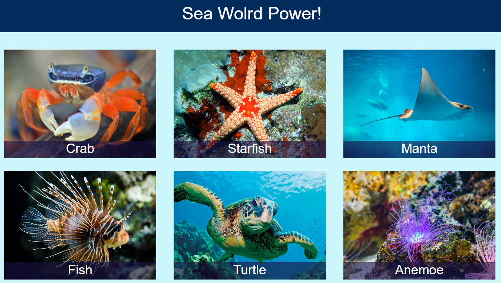

# 🐬 Sea-World

The project contains examples of 6 different css effects and animations. 
Old project from April 2020.

## ⚙️ Technologies
   

- HTML, CSS, Bootstrap

## 🖥️ Preview

https://alicjalysien.github.io/Sea-World/

##
Sources for images added as comments in HTML code.
